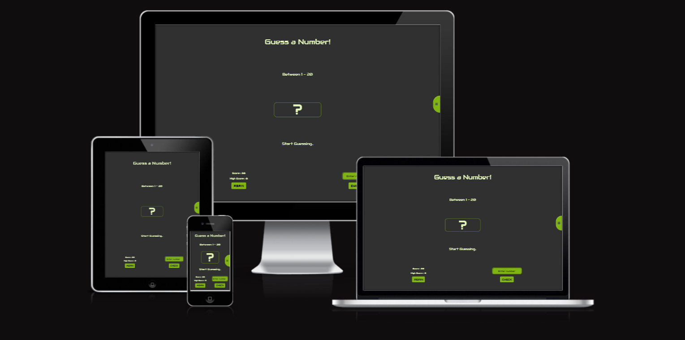

# Guess a Number

Guess the number is a game in which the user tries to guess a number between one and twenty.
I wrote this game to practice bootstrap, css, scss and javascript.
I have included six themes in the game that are completely unnecessary, but they served me for scss practice.

## Demo

You can access the game [here.](https://ivantepes.github.io/guess-a-number/)

## Theme Colours

| Color           | Hex                                                              |
| --------------- | ---------------------------------------------------------------- |
| theme\_\_light  |  #d9d9d9 |
| theme\_\_dark   |  #303030 |
| theme\_\_brown  |  #55423d |
| theme\_\_green  |  #004643 |
| theme\_\_purple |  #6246ea |
| theme\_\_blue   |  #001534 |
